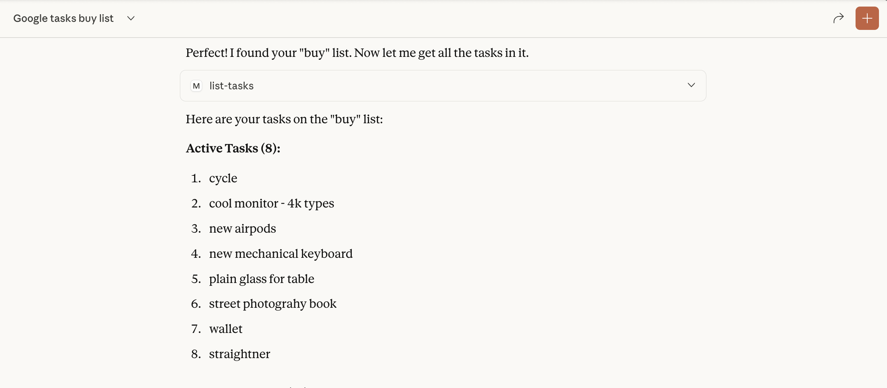
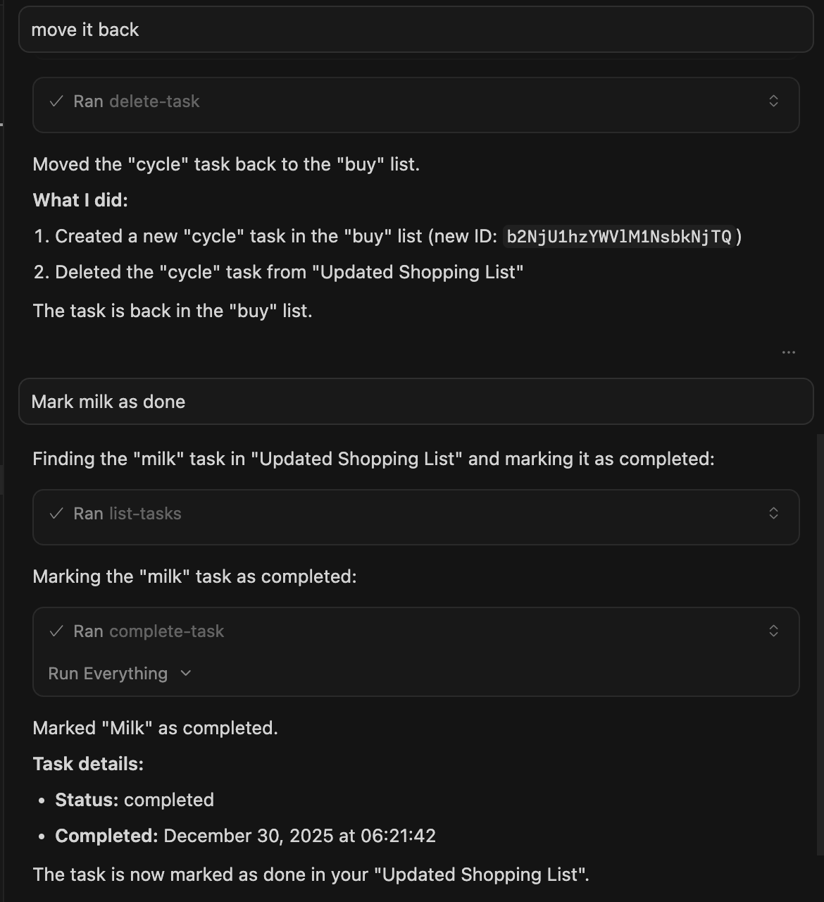

# Google Tasks MCP Server

This Model Context Protocol (MCP) server provides a bridge between Claude and Google Tasks, allowing you to manage your task lists and tasks directly through Claude.

> [!NOTE]
> All (bar some edits) code in this project was ["vibe coded"](https://en.wikipedia.org/wiki/Vibe_coding) - generated with Claude/Copilot with instructions from me.

## Features

This MCP server provides the following functionality:

### Task List Management
- `list-tasklists` - List all your task lists
- `get-tasklist` - Get details about a specific task list
- `create-tasklist` - Create a new task list
- `update-tasklist` - Update an existing task list
- `delete-tasklist` - Delete a task list

### Task Management
- `list-tasks` - List all tasks in a task list
- `get-task` - Get details about a specific task
- `create-task` - Create a new task
- `update-task` - Update an existing task
- `delete-task` - Delete a task
- `complete-task` - Mark a task as completed
- `move-task` - Move a task (reorder or change parent)
- `clear-completed-tasks` - Clear all completed tasks from a list

## Setup Instructions

### 1. Create Google Cloud Project & Enable API

1. Go to the [Google Cloud Console](https://console.cloud.google.com/)
2. Create a new project
3. Navigate to "APIs & Services" > "Library"
4. Search for "Google Tasks API" and enable it
5. Go to "APIs & Services" > "Credentials"
6. Click "Create Credentials" > "OAuth Client ID"
7. Configure the OAuth consent screen (External is fine for personal use)
8. For Application Type, select "Web application"
9. Add "http://localhost:3000/oauth2callback" as an authorized redirect URI
10. Create the client ID and secret

### 2. Configure Claude for Desktop

1. Install [Claude for Desktop](https://claude.ai/download)
2. Open the Claude configuration file:
   - MacOS: `~/Library/Application Support/Claude/claude_desktop_config.json`
   - Windows: `%APPDATA%\Claude\claude_desktop_config.json`
3. Add the Google Tasks MCP server configuration:

```json
{
  "mcpServers": {
    "google-tasks": {
      "command": "node",
      "args": ["/path/to/google-tasks-mcp/build/index.js"],
      "env": {
        "GOOGLE_CLIENT_ID": "your_client_id_here",
        "GOOGLE_CLIENT_SECRET": "your_client_secret_here",
        "GOOGLE_REDIRECT_URI": "http://localhost:3000/oauth2callback"
      }
    }
  }
}
```

Replace the path and credentials with your own values.

**Environment Variables:**
- `GOOGLE_CLIENT_ID` (required) - Your Google OAuth Client ID
- `GOOGLE_CLIENT_SECRET` (required) - Your Google OAuth Client Secret  
- `GOOGLE_REDIRECT_URI` (optional) - OAuth redirect URI (defaults to `http://localhost:3000/oauth2callback`)

**Note:** The server validates that `GOOGLE_CLIENT_ID` and `GOOGLE_CLIENT_SECRET` are set at startup and will fail with clear error messages if they are missing or invalid.

### 3. Build and Run the Server

1. Install dependencies:
```bash
npm install
```

2. Build the server:
```bash
npm run build
```

3. Restart Claude for Desktop

## Authentication Flow

When you first use the Google Tasks MCP server:

1. Use the `authenticate` tool to get an authorization URL
2. Visit the URL in your browser and sign in with your Google account
3. After authorizing, you'll receive a code on the browser page
4. Use the `set-auth-code` tool with this code to complete authentication
5. You can now use all other tools to interact with Google Tasks

**Note:** Your authentication tokens (including refresh tokens) are automatically saved to disk at `~/.config/google-tasks-mcp/credentials.json` with restricted permissions (600). This means:
- **You only need to authenticate once** - credentials persist across server restarts
- **Automatic token refresh** - Access tokens are automatically refreshed when they expire (typically after 1 hour) using the saved refresh token
- **No re-authentication needed** - After the initial setup, you won't need to authenticate again unless you revoke access or delete the credentials file

## Requirements

- Node.js 20+ (see `package.json` engines)
- Claude for Desktop (latest version)
- Google Cloud Project with Tasks API enabled

## Implementation Features

This MCP server includes the following improvements:
- **Persistent token storage** - Authentication credentials are saved to disk (`~/.config/google-tasks-mcp/credentials.json`) with restricted permissions, so you only need to authenticate once
- **Environment variable validation** - Startup validation ensures required credentials are configured with clear error messages
- **Automatic token refresh** - OAuth tokens are automatically refreshed when they expire, eliminating the need to re-authenticate during active sessions or after restarts
- **Enhanced input validation** - Comprehensive validation of all inputs including ID formats, string lengths, and RFC 3339 date formats
- **HTML sanitization** - OAuth callback responses are sanitized to prevent XSS vulnerabilities
- **Graceful shutdown** - Proper cleanup of resources on SIGINT/SIGTERM signals
- **Type safety** - Full TypeScript type safety throughout the codebase with proper interfaces
- **Configurable redirect URI** - The OAuth redirect URI can be customized via the `GOOGLE_REDIRECT_URI` environment variable

## Screenshots

### Claude Desktop


### Cursor


## License

This project is for demonstration purposes only. Use at your own risk.
